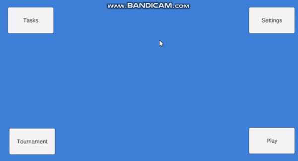

# Simple Menu Tutorial System In Unity

This is a simple Menu tutorial system created via the `Command Queue (Event Queue)` design pattern in Unity3D. This repository is mainly for implementing and showing how the command queue (event queue) pattern is working. You should take the idea of the pattern and implement a more advanced tutorial system for your game.

Demo:

